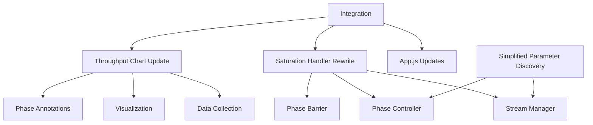

# LibreQoS Bufferbloat Test Rewrite Project

## Executive Summary

The LibreQoS Bufferbloat Test application is experiencing issues with download traffic continuing past phase boundaries, specifically past phase 3. Additionally, the current parameter discovery methodology in warmup phases tends to overshoot and cause network congestion. This document outlines a comprehensive rewrite plan to address these issues and improve the overall reliability and accuracy of the test.

## Problem Statement

1. **Download traffic continues past phase boundaries**: Despite attempts to implement a hard barrier between test phases, download traffic is still continuing past the end of phase 3, as observed in network graphs.

2. **Throughput chart doesn't show all traffic**: The current implementation may be hiding some traffic in the visualization, making it difficult to diagnose issues.

3. **Complex stream management**: The current implementation of the saturation handler is complex and lacks clear separation between phases, making it difficult to ensure clean transitions.

4. **Parameter discovery overshooting**: The current parameter discovery methodology in warmup phases (2 and 4) tends to overshoot and cause network congestion, leading to unreliable test results.

## Solution Overview

A complete rewrite of the saturation handler with a simpler methodology and clearer separation of phases, along with updates to the throughput chart to display all network activity. Additionally, a simplified parameter discovery methodology will be implemented to prevent overshooting and network congestion during warmup phases.

## Key Components

### 1. Stream Manager

A new Stream Manager component will handle the creation, tracking, and termination of all network streams. It will provide a robust registry system for tracking active streams and ensure proper cleanup when streams are terminated.

### 2. Phase Controller

The Phase Controller will manage test phases and ensure clean transitions between them. It will enforce a hard barrier between phases, preventing traffic from continuing past phase boundaries.

### 3. Phase Barrier

The Phase Barrier will ensure that no traffic continues across phase boundaries. It will implement multiple verification mechanisms and emergency cleanup procedures to guarantee clean transitions.

### 4. Throughput Monitor

The Throughput Monitor will track and report all network activity, regardless of phase. It will provide accurate throughput measurements and detect out-of-phase traffic.

### 5. Throughput Chart Updates

The Throughput Chart will be updated to display all network activity, including traffic that continues past phase boundaries. It will provide clear visual indicators for phase transitions and out-of-phase traffic.

### 6. Simplified Parameter Discovery

A new parameter discovery methodology will be implemented for warmup phases (2 and 4) to find optimal parameters without overshooting and causing network congestion. It will use a linear ramp-up approach with strict latency thresholds instead of binary search.

## Design Principles

1. **Clear Phase Separation**: Each phase should be completely isolated, with no possibility of traffic continuing across phase boundaries.

2. **Synchronous Phase Transitions**: Ensure all resources from the previous phase are fully released before starting the next phase.

3. **Comprehensive Monitoring**: Display all network activity in the UI, even if it's unexpected or erroneous.

4. **Fail-safe Mechanisms**: Implement multiple layers of protection to ensure streams are terminated.

5. **Simplified Architecture**: Use a more straightforward and modular design for easier maintenance and debugging.

6. **Conservative Parameter Discovery**: Use a conservative approach to parameter discovery that prioritizes stability over speed.

7. **Latency-Aware Testing**: Maintain awareness of latency throughout the test and adjust parameters accordingly to prevent congestion.

## Implementation Timeline

### Week 1: Core Implementation

#### Days 1-2: Core Infrastructure
- Implement Stream Manager
- Create Phase Controller
- Develop Phase Barrier
- Build test harness

#### Days 3-4: Throughput Monitoring
- Implement Throughput Monitor
- Update Throughput Chart
- Add phase annotations
- Integrate components

#### Days 5-6: Integration and Testing
- Update App.js
- Integrate with existing components
- Perform end-to-end testing
- Fix bugs and optimize

### Week 2: Refinement and Deployment

#### Days 7-8: Edge Case Handling
- Implement network interruption handling
- Add high latency compensation
- Improve error recovery
- Enhance debugging tools

#### Days 9-10: Documentation and Deployment
- Create implementation documentation
- Prepare deployment package
- Perform final testing
- Deploy to production

## Testing Strategy

### Unit Testing
- Test individual components in isolation
- Verify component behavior with various inputs
- Test error handling and edge cases

### Integration Testing
- Test component interactions
- Verify data flow between components
- Test phase transitions

### End-to-End Testing
- Test complete test cycle
- Verify clean phase transitions
- Validate throughput measurements
- Check for traffic continuing past phases

## Success Criteria

1. **Clean Phase Transitions**: No traffic continues past phase boundaries.

2. **Accurate Visualization**: All network activity is displayed in the throughput chart.

3. **Reliable Test Results**: Test results are consistent and accurate.

4. **Improved User Experience**: The test runs smoothly without unexpected behavior.

5. **Optimal Parameter Discovery**: Parameters are discovered without overshooting or causing excessive congestion.

6. **Latency Stability**: Latency remains within acceptable thresholds throughout the test.

## Conclusion

This rewrite project will address the current issues with the LibreQoS Bufferbloat Test and provide a more robust and reliable solution. By implementing clear phase separation, comprehensive monitoring, and fail-safe mechanisms, we can ensure that the test accurately measures network performance and provides valuable insights into bufferbloat issues.

## Next Steps

1. Review and approve the rewrite plan
2. Allocate resources for implementation
3. Begin implementation of core components
4. Conduct regular progress reviews
5. Deploy and monitor the new implementation

## Related Documents

- [Saturation Handler Rewrite Plan](bufferbloat-test-saturation-rewrite-plan.md)
- [Throughput Chart Update Plan](throughput-chart-update-plan.md)
- [Saturation Handler Implementation Plan](saturation-handler-implementation-plan.md)
- [Parameter Discovery Simplification Plan](parameter-discovery-simplification-plan.md)